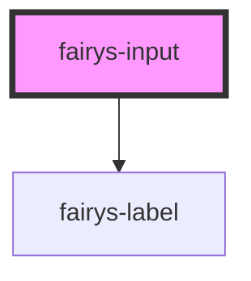

# fairys-input

<!-- Auto Generated Below -->

## Properties

| Property      | Attribute     | Description | Type                                                                                                                                     | Default     |
| ------------- | ------------- | ----------- | ---------------------------------------------------------------------------------------------------------------------------------------- | ----------- |
| `colon`       | `colon`       |             | `boolean`                                                                                                                                | `true`      |
| `label`       | `label`       |             | `string`                                                                                                                                 | `undefined` |
| `layoutType`  | `layout-type` |             | `"floating" \| "left" \| "top"`                                                                                                          | `'left'`    |
| `name`        | `name`        |             | `string`                                                                                                                                 | `undefined` |
| `placeholder` | `placeholder` |             | `string`                                                                                                                                 | `'请输入'`     |
| `type`        | `type`        |             | `"date" \| "datetime-local" \| "email" \| "month" \| "number" \| "password" \| "search" \| "tel" \| "text" \| "time" \| "url" \| "week"` | `'text'`    |

## Dependencies

### Depends on

- [fairys-label](../label)

### Graph

----------------------------------------------

*Built with [StencilJS](https://stenciljs.com/)*
