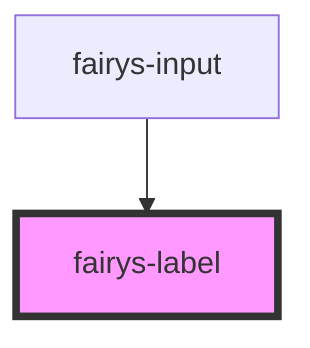

# fairys-label

<!-- Auto Generated Below -->

## Properties

| Property  | Attribute  | Description | Type      | Default     |
| --------- | ---------- | ----------- | --------- | ----------- |
| `colon`   | `colon`    |             | `boolean` | `true`      |
| `htmlFor` | `html-for` |             | `string`  | `undefined` |
| `label`   | `label`    |             | `string`  | `undefined` |

## Dependencies

### Used by

 - [fairys-input](../input)

### Graph

----------------------------------------------

*Built with [StencilJS](https://stenciljs.com/)*
